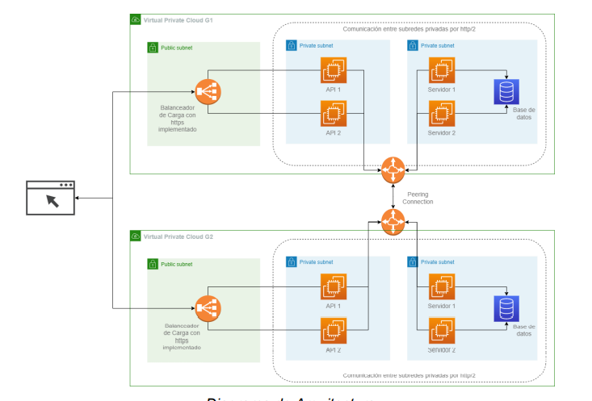
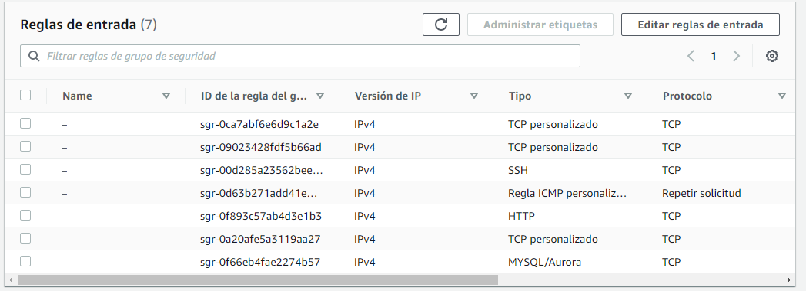
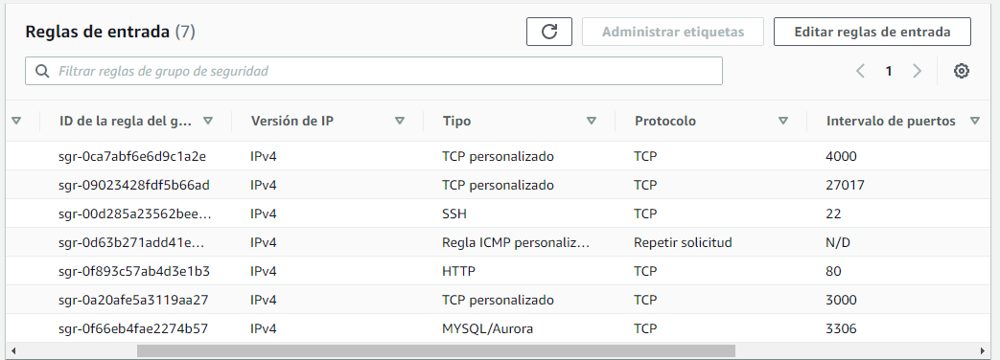
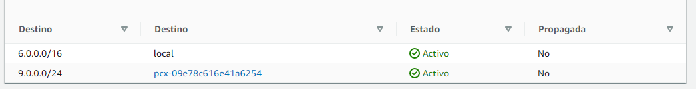
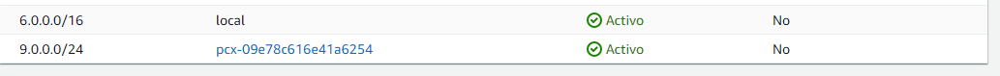

# REDES2_1S2022_GRUPO6 
---

## Grupo #6

| Carnet | Nombre |
| ------ | ------ |
| 201503702 | Edgar Humberto Borrayo Bartolón |
| 201908321 | Katerine Adalinda Santos Ramirez | 
| 201908335 | Oscar Rene Rodriguez Vasquez |
| 201905837 | Ariel Rubelce Macario Coronado |

### Arquitectura usada.
Para el desarrollo de este proyecto se hizo uso de la siguiente arquitectura.

Donde se utilizaron los siguientes servicios que aws nos proporciona:
- Balanceador de cargas: Ese nos ayudó a conectar dos ec2 que contienen nuestra imagen de nuestro frontend.
- EC2: Las cuales son las encargas del despliegue del frontend, backend y base de datos.
- peering connection: El cual nos ayudó con la conexion con las dos VPC. la del grupo 9 y con el grupo 6.
- VPC: el cual nos sirvió para montar nuetras red con sus subredes.

### ACLS.

Estos son los permisos que tendran nuestras sub redes, ya sea para denegar o permitir trafico.

Son los permisos que traia por default nuestra VPC.

### Security Groups.

Estos son los permisos que nuestras ec2 tienen.

Basicamente aca se describen los permisos que nuestras ec2 tienen.

+ El puerto 4000: nos sirve para la comunicacion de las instancias.
- Eñ puerto 27017, nos sirve para conectarnos al backeend.
- El SHH nos sirve para contarnos con una buena siruguia.
- las reglas de ICMP nos sirve para realizar ping entro de las VPC y Fuera de ellas.
- Puerto 89: lo usa el loadbalance, el cual utiliza dicho puerto.
- Puerto 3000, para las pruenas de los levatamientos de las images de froent.
- Puerto 3306, para la comunicacion de la bas de datos.
### Tabla de routeo principal.

### Tabla de routeo secundarioa.

