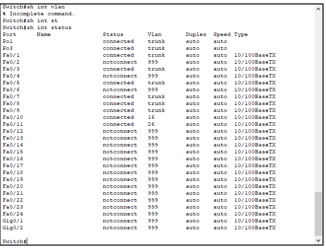
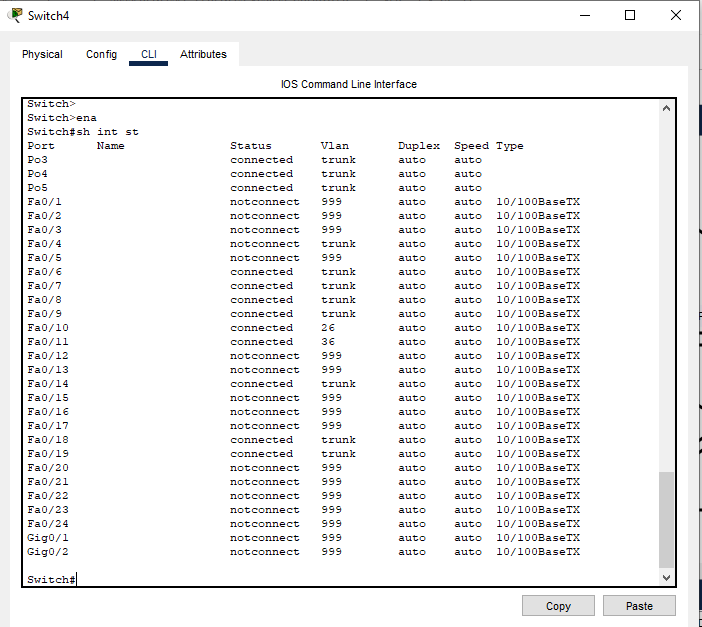

# Practica 1
---
## Grupo #6
| Carnet | Nombre |
| ------ | ------ |
| 201503702 | Edgar Humberto Borrayo Bartolón |
| 201908321 | Katerine Adalinda Santos Ramirez | 
| 201908335 | Oscar Rene Rodriguez Vasquez |
| 201905837 | Ariel Rubelce Macario Coronado |

---
## _Sub Redes Necesarias_
Se realiza el calculo para obtener las Sub redes necesarias, teniendo en cuenta utilizar la forma de calculo VLSM y una cantidad maxima de 30 dispositivos por SubRed. Por lo que el resultado del calculo es el siguiente:

| VLAN                | SubRed         | Pimer Asignable | Ultima Asignable | Broadcast      | MascaraSubred        |
| ------              | ------         | ------          | ------           | ------         | ------               |
| Ventas           16 | 192.168.86.0   | 192.168.86.1    | 192.168.86.30    | 192.168.86.31  | 255.255.255.224 / 27 |
| Distribucion     26 | 192.168.86.32  | 192.168.86.33   | 192.168.86.62    | 192.168.86.63  | 255.255.255.224 / 28 |
| Administracion   36 | 192.168.86.64  | 192.168.86.65   | 192.168.86.94    | 192.168.86.95  | 255.255.255.224 / 29 |
| Servidores       46 | 192.168.86.96  | 192.168.86.97   | 192.168.86.126   | 192.168.86.127 | 255.255.255.224 / 30 |
| Magnament&Native    | 192.168.86.128 | 192.168.86.129  | 192.168.86.158   | 192.168.86.159 | 255.255.255.224 / 31 |
| BlackHole           | 192.168.86.160 | 192.168.86.160  | 192.168.86.161   | 192.168.86.191 | 255.255.255.224 / 32 |

## _Configuracion VLAN y VTP_
### Configuracion VLAN Router (R0)
Se inicia configurando el Router con las Vlans, aplicando los siguientes comandos
```sh
enable
configure terminal
vlan 16
name Ventas
exit
vlan 26
name Distribucion
exit
vlan 36
name Administracion
exit
vlan 46
name Servidores
exit
exit
```

#### Configuracion VTP Router (R0)
Se inicia configurando el Router como servidor de VTP, aplicando los siguientes comandos
```sh
enable
configure terminal
vtp mode server
vtp domain g6
vtp password g6
exit
show vtp status
copy running-config startup-config
```
#### Resultado de configuración


### Configuracion VLAN Switch0 (S0)
Se inicia configurando el Switch con las Vlans 16-Ventas y 26-Distribucion, aplicando los siguientes comandos
```sh
enable
configure terminal
vlan 16
name Ventas
exit
vlan 26
name Distribucion
exit
vlan 36
name Administracion
exit
vlan 46
name Servidores
exit
exit

configure terminal
interface F0/10
switchport access vlan 16
switchport mode trunk
switchport nonegotiate
exit
interface F0/11
switchport access vlan 26
switchport mode trunk
switchport nonegotiate
exit
exit
```
#### Configuracion VTP Switch0 (S0)
Se inicia configurando el Router como servidor de VTP, aplicando los siguientes comandos
```sh
configure terminal
vtp mode client
vtp domain g6
vtp password g6
exit
show vtp status
copy running-config startup-config
```
#### Resultado de configuración


### Configuracion Switch2 (S2)
Se inicia configurando el Switch con las Vlans 26-Distribucion y 36-Administracion, aplicando los siguientes comandos
```sh
enable
configure terminal
vlan 16
name Ventas
exit
vlan 26
name Distribucion
exit
vlan 36
name Administracion
exit
vlan 46
name Servidores
exit
exit

configure terminal
interface F0/10
switchport access vlan 36
switchport mode trunk
switchport nonegotiate
exit
interface F0/11
switchport access vlan 26
switchport mode trunk
switchport nonegotiate
exit
exit
```
#### Configuracion VTP Switch2 (S2)
Se inicia configurando el Router como servidor de VTP, aplicando los siguientes comandos
```sh
configure terminal
vtp mode client
vtp domain g6
vtp password g6
exit
show vtp status
copy running-config startup-config
```

#### Resultado de configuración


#### Configuración Intervlan R1

Switch#conf t
Enter configuration commands, one per line.  End with CNTL/Z.
Switch(config)#interface fastEthernet 0/1
Switch(config-if)#switchport trunk encapsulation dot1q 
Switch(config-if)#switchport mode trunk 

Switch(config-if)#
%LINEPROTO-5-UPDOWN: Line protocol on Interface FastEthernet0/1, changed state to down

%LINEPROTO-5-UPDOWN: Line protocol on Interface FastEthernet0/1, changed state to up

Switch(config-if)#switchport trunk allowed vlan 16,26,36,46
Switch(config-if)#exit
!
Switch(config)#interface vlan 16 
Switch(config-if)#
%LINK-5-CHANGED: Interface Vlan16, changed state to up

%LINEPROTO-5-UPDOWN: Line protocol on Interface Vlan16, changed state to up

Switch(config-if)#description Ventas
Switch(config-if)#ip address 192.168.86.1 255.255.255.224
Switch(config-if)#no shutdown 
Switch(config-if)#
Switch(config-if)#exit
Switch(config)#interface vlan 26
Switch(config-if)#
%LINK-5-CHANGED: Interface Vlan26, changed state to up

%LINEPROTO-5-UPDOWN: Line protocol on Interface Vlan26, changed state to up

Switch(config-if)#description Distribucion
Switch(config-if)#ip address 192.168.86.33 255.255.255.224
Switch(config-if)#no shutdown 
Switch(config-if)#exit
Switch(config)#interface vlan 36
Switch(config-if)#
%LINK-5-CHANGED: Interface Vlan36, changed state to up

%LINEPROTO-5-UPDOWN: Line protocol on Interface Vlan36, changed state to up

Switch(config-if)#description Administracion
Switch(config-if)#ip address 192.168.86.65 255.255.255.224
Switch(config-if)#no shut
Switch(config-if)#exit
Switch(config)#int
Switch(config)#interface vlan 46
Switch(config-if)#
%LINK-5-CHANGED: Interface Vlan46, changed state to up

%LINEPROTO-5-UPDOWN: Line protocol on Interface Vlan46, changed state to up

Switch(config-if)#description Servidores
Switch(config-if)#ip address 192.168.86.97 255.255.255.224
Switch(config-if)#no shutdown 
Switch(config-if)#exit

Switch(config)#ip routing  

---
## Configuracion PVST y Rapid PVST

### Comandos PVST
```sh
enable
conf t
spanning-tree mode pvst
exit

show spanning-tree
exit
```
### Evidencia PVST


### Comandos Rapid PVST
```sh
enable
conf t
spanning-tree mode rapid-pvst
exit
show spanning-tree
exit
```
### Evidencia Rapid PVST


---
## Configuracion Etherchannel

### Comandos S0 LACP y PAGP
Comandos LACP
```sh
enable
conf t
int fa 0/3
channel-protocol lacp
channel-group 1 mode active
exit
int fa 0/5
channel-protocol lacp
channel-group 1 mode active
exit


enable
conf t
int range fa 0/8-9
channel-protocol lacp
channel-group 3 mode active
exit
```
Comandos PAGP
```sh
enable
conf t
int fa 0/3
channel-protocol pagp
channel-group 1 mode desirable
exit
int fa 0/5
channel-protocol pagp
channel-group 1 mode desirable
exit


enable
conf t
int range fa 0/8-9
channel-protocol pagp
channel-group 3 mode desirable
exit
```


### Evidencia S0 LACP y PAGP


### Comandos S1 LACP y PAGP
Comandos LACP
```sh
enable
conf t
int fa 0/3
channel-protocol lacp
channel-group 1 mode active
exit
int fa 0/5
channel-protocol lacp
channel-group 1 mode active
exit


enable
conf t
int fa 0/2
channel-protocol lacp
channel-group 2 mode active
exit
int fa 0/4
channel-protocol lacp
channel-group 2 mode active
exit


enable
conf t
int range fa 0/6-7
channel-protocol lacp
channel-group 5 mode active
exit
```
Comandos PAGP
```sh
enable
conf t
int fa 0/3
channel-protocol pagp
channel-group 1 mode desirable
exit
int fa 0/5
channel-protocol pagp
channel-group 1 mode desirable
exit


enable
conf t
int fa 0/2
channel-protocol pagp
channel-group 2 mode desirable
exit
int fa 0/4
channel-protocol pagp
channel-group 2 mode desirable
exit


enable
conf t
int range fa 0/6-7
channel-protocol pagp
channel-group 5 mode desirable
exit
```


### Evidencia S1 LACP y PAGP


### Comandos S2 LACP y PAGP
Comandos LACP
```sh
enable
conf t
int fa 0/2
channel-protocol lacp
channel-group 2 mode active
exit
int fa 0/4
channel-protocol lacp
channel-group 2 mode active
exit


enable
conf t
int range fa 0/18-19
channel-protocol lacp
channel-group 4 mode active
exit
```
Comandos PAGP
```sh
enable
conf t
int fa 0/2
channel-protocol pagp
channel-group 2 mode desirable
exit
int fa 0/4
channel-protocol pagp
channel-group 2 mode desirable
exit


enable
conf t
int range fa 0/18-19
channel-protocol pagp
channel-group 4 mode desirable
exit
```


### Evidencia S2 LACP y PAGP


### Comandos S4 LACP y PAGP
Comandos LACP
```sh
enable
conf t
int range fa 0/8-9
channel-protocol lacp
channel-group 3 mode active
exit


enable
conf t
int range fa 0/18-19
channel-protocol lacp
channel-group 4 mode active
exit


enable
conf t
int range fa 0/6-7
channel-protocol lacp
channel-group 5 mode active
exit
```
Comandos PAGP
```sh
enable
conf t
int range fa 0/8-9
channel-protocol pagp
channel-group 3 mode desirable
exit


enable
conf t
int range fa 0/18-19
channel-protocol pagp
channel-group 4 mode desirable
exit


enable
conf t
int range fa 0/6-7
channel-protocol pagp
channel-group 5 mode desirable
exit
```


### Evidencia S4 LACP y PAGP


### Mostrar Configuraciones
```sh
enable
show etherchannel
show etherchannel summary
show spanning-tree
```

### Tabla de Convergencias

|           | PVST           | Rapid PVST     |
|-----------|----------------|----------------|
| **LACP**  | 46.42 segundos | 16.15 segundos |
| **PAGP**  | 47.20 segundos | 16.50 segundos |


### Conclusion convergencia
Se utilizo una convinacion de configuracion de protocolo etherchannel LACP con sus puertos en modo active/active, con una configuracion de STP de Rapid PVST. Ya que para los tiempos documentados fue el que obtuvo menor convergencia para reestablecer la conexion.

---
## InterVlan
Se configuró el Switch 3560-24PS el cual es capa 3, para que este reenviara el tráfico de red de una VLAN a otra
VLAN. De los 3 tipos de enrutamiento intervlan que hay se utilizó el llamado "Switch de capa 3 con interfaces virtuales (SVIs)" esto debido a que es la solución más escalable para esta práctica.

Comandos para configurar intervlan en un switch capa 3:
```sh
int vlan 16
description Interfaz de enlace para vlan 16
ip address 192.168.86.1 255.255.255.224
no shutdown
exit
int vlan 26
description Interfaz de enlace para vlan 26
ip address 192.168.86.33 255.255.255.224
no shutdown
exit
int vlan 36
description Interfaz de enlace para vlan 36
ip address 192.168.86.65 255.255.255.224
no shutdown
exit
int vlan 46
description Interfaz de enlace para vlan 46
ip address 192.168.86.97 255.255.255.224
no shutdown
exit
```


Comandos para crear las vlans en el switch capa 3:
```sh
vlan 16
name Ventas
exit
vlan 26
name Distribucion
exit
vlan 36
name Administracion
exit
vlan 46
name Servidores
exit
```
Vlans creadas en el swtich capa 3


Comandos para activar la opcion de routeo en el switch capa 3:
```sh
ip routing
```
---

## Seguridad.
Se configuró el port-security a todas las interfaces, exceptuando las interfaces troncales, se configuruo con el siguiente comando.

```sh
interface range f0/2 - 24
switchport mode access
switchport port-security
```
Para desactivar el protocolo DTP se usó el siguiente comando.
```sh
switchport nonegotiate 
```
Se agregaron las interfaces sin usar al BlackHole la cual es la vlan 999.
Switch 0.



Switch 1.


Switch 2.


Switch 3.


Switch 4.



Switch 5.


Switch R1.


## Seguridad Ventas
Se configuró con los siguientes comandos.
```sh
enable
config terminal
interface f0/10
switchport port-security mac-address sticky
switchport port-security maximum 5
exit
```
al igual se adjunto evidencia del comando.


## Seguridad Distribucion
Se configuró con los siguientes comandos.
```sh
enable
config terminal
interface f0/10
switchport port-security mac-address sticky
switchport port-security maximum 1
switchport port-security violation shutdown
exit
```
al igual se adjunto evidencia del comando.


## Seguridad Adminstracion
Se configuró con los siguientes comandos.
```sh
enable
config terminal
interface f0/10
switchport port-security mac-address 000D.BD3E.26DC
switchport port-security maximum 1
switchport port-security violation shutdown
exit
```
al igual se adjunto evidencia del comando.


---
## Sevidor
Se empleo el Servidor 0 para almacenar y transmitir el contenido solicitado de un sitio web al navegador de cualquier usuario que lo requiera.

Se empleo el siguiente codigo html para agregar los datos de los integrantes en el index.html:
```sh
<html>
<center><font size='+2' color='blue'>Cisco Packet Tracer</font></center>
<h4>Ariel Rubelce Macario Coronado - 201905837</h4>
<h4>Oscar Rene Rodriguez Vazques - 201908335</h4>
<h4>Edgar Humberto Borrayo Bartolón - 201503702</h4>
<h4>Katerine Adalinda Santos Ramires - 201908321</h4>
<h4>Servidor 0</h4>
</html>
```
La apariencia de la página web es la siguiente:


